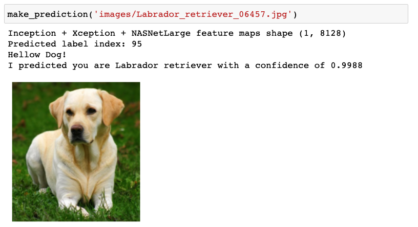
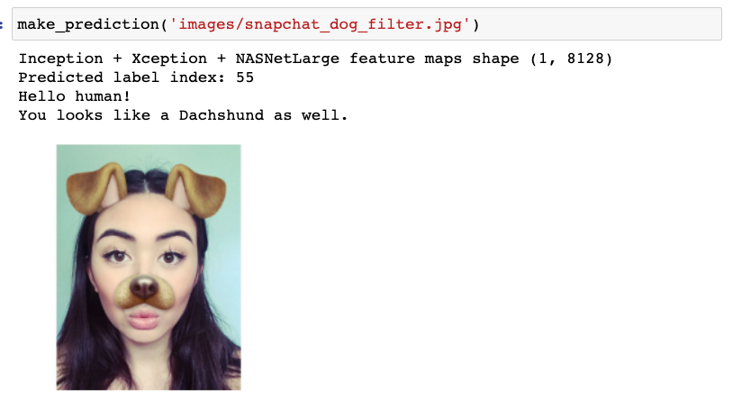

    
# Dog Breed Classification

### Table of Contents   
1. [Description](#description)
2. [Installation](#installation)
3. [File Descriptions](#files)
4. [Licensing, Authors, and Acknowledgements](#licensing)

## Description<a name="description"></a>

In this project, I build a Convolutional Neural Networks (CNN) to classify dog breeds with 92% accuracy. It can also detect a human and determine what kind of breed the person looks like.





## Installation <a name="installation"></a>

Reguired installations:

* Jupyter Notebooks (Anaconda Distribution)
* Python 3.8.5

1. Clone the repository and navigate to the downloaded folder.
```
    git clone https://github.com/tinachientw/DSND_Dog_Breed_Classification
    cd DSND_Dog_Breed_Classification
```

2. Download the [dog dataset](https://s3-us-west-1.amazonaws.com/udacity-aind/dog-project/dogImages.zip).  Unzip the folder and place it in the repo, at location `data/dog_image`. 

3. Download the [human dataset](https://s3-us-west-1.amazonaws.com/udacity-aind/dog-project/lfw.zip).  Unzip the folder and place it in the repo, at location `data/lfw`.  If you are using a Windows machine, you are encouraged to use [7zip](http://www.7-zip.org/) to extract the folder. 

4. Donwload the [VGG-16 bottleneck features](https://s3-us-west-1.amazonaws.com/udacity-aind/dog-project/DogVGG16Data.npz) for the dog dataset.  Place it in the repo, at location `data/bottleneck_features`.

5. (Optional) __If you plan to install TensorFlow with GPU support on your local machine__, follow [the guide](https://www.tensorflow.org/install/) to install the necessary NVIDIA software on your system.  If you are using an EC2 GPU instance, you can skip this step.

6. Switch [Keras backend](https://keras.io/backend/) to TensorFlow.
    - __Linux__ or __Mac__: 
        ```
        KERAS_BACKEND=tensorflow python -c "from keras import backend"
        ```
    - __Windows__: 
        ```
        set KERAS_BACKEND=tensorflow
        python -c "from keras import backend"
        ```

## File Descriptions <a name="files"></a>

1. Bottleneck features:
    If you don't want to compute the bottleneck features again. You can download the features I have computed by following link. Make sure you save the features under the `bottleneck_features` folder.
    * https://drive.google.com/drive/folders/1yHiwqBCRa0RzRzlEGMri5Xr6P6TbqtHB?usp=sharing
    
2. model:
    * `dog_app.ipynb`: dog breed classification program


## Licensing, Authors, Acknowledgements<a name="licensing"></a>

This project was completed as part of the [Udacity Data Scientist Nanodegree](https://www.udacity.com/course/data-scientist-nanodegree--nd025).


